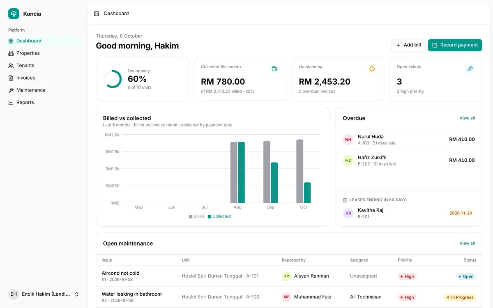
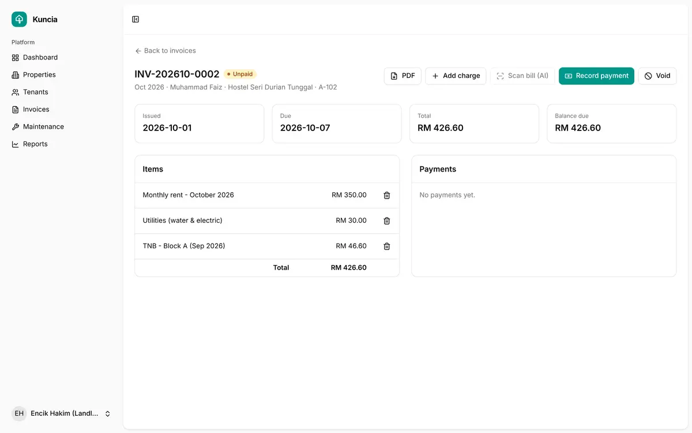
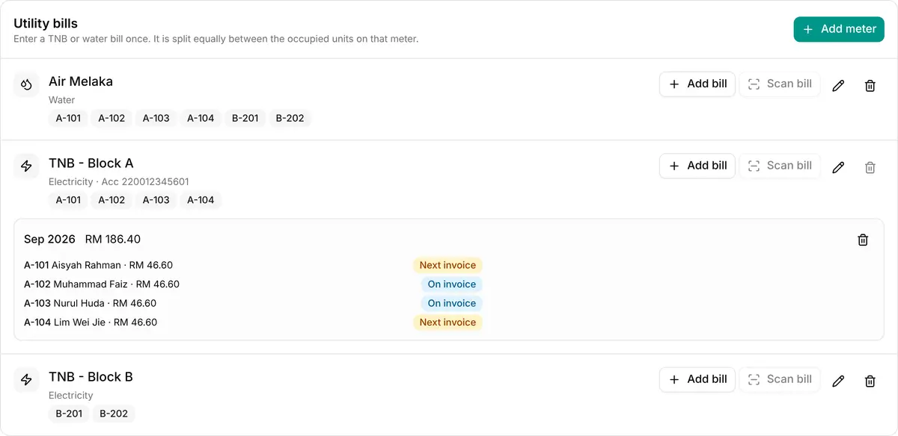

# Kuncia

Rental management for small landlords. Rent invoices, utility bills, payments and repair tickets in one place.

I built it for my family's rentals (houses, rooms and a two-floor shop), and it runs in real use. Other landlords can use it too: get in touch and I'll set up an account.

**Live demo:** https://kuncia.syaheerdaniel.dev (the guest login is shown on the login page, and the guest data resets every night)



| Invoices | Utility bill split |
|---|---|
|  |  |

## What it does

Three roles: **landlord**, **tenant** and **maintenance staff**.

**Landlord**
- Properties: house, apartment, room, hostel or shop, each with its own units
- Tenancies with rent, deposit and start/end dates
- Invoices made automatically on the 1st of every month and marked overdue when unpaid
- Extra charges on an invoice, PDF download, and cash or bank transfer payments recorded by hand
- Utility bills per meter (TNB, SAMB, etc). One meter can cover several units, like one shop floor. Each bill is split equally between the tenants renting that month and added to their open invoice
- Bill reading with the Gemini API: upload a photo of the bill, it reads the amount and period, and you confirm before saving
- Dashboard with occupancy, collected vs billed, overdue rent and leases ending soon

**Tenant**
- See their own invoices and payments
- Report a repair with photos and follow its status

**Maintenance staff**
- A task list of the tickets assigned to them

Online payment through ToyyibPay (FPX) is built and tested against the ToyyibPay sandbox. It isn't live yet.

## Stack

- Laravel 13, PHP 8.3, MySQL
- Inertia + React 19, TypeScript, Tailwind CSS 4, shadcn/ui
- Gemini API for bill reading
- Pest for tests, PHPStan level 7, Pint

## How it runs

- Hostinger VPS (Ubuntu 24.04) with Nginx, PHP-FPM and MySQL, behind Cloudflare
- Pushing to `main` runs tests, PHPStan and lint checks in GitHub Actions. If they pass, it deploys over SSH with a key that can only run `deploy.sh`
- `deploy.sh` puts the site in maintenance mode, pulls, installs, migrates, builds the frontend, then brings it back up (it comes back up even if a step fails)
- Cron runs the Laravel scheduler (invoices, overdue checks, guest reset), and Supervisor keeps the queue worker running
- Daily database backups, kept for 7 days

## Run it locally

```bash
composer setup              # install, .env, key, migrate, build
php artisan db:seed         # demo data
composer dev                # app + Vite
```

Demo accounts (password `password`): `landlord@kuncia.test`, `tenant@kuncia.test`, `tech@kuncia.test`

Optional `.env` keys:
- `GEMINI_API_KEY` turns on bill reading
- `TOYYIBPAY_SECRET_KEY` and `TOYYIBPAY_CATEGORY_CODE` turn on online payment (sandbox by default)

Checks: `composer ci:check`
